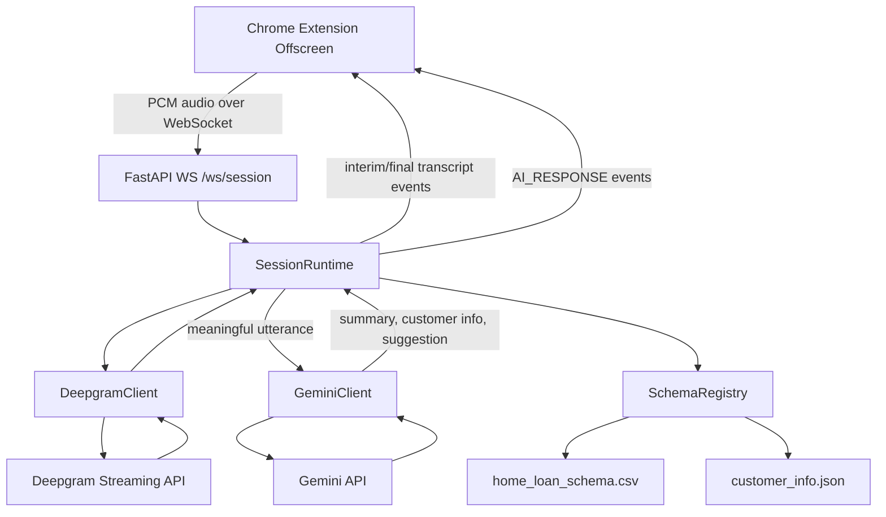

# Backend Architecture

## Purpose

The backend is the real-time processing core for the Chrome extension. It centralizes transcription, utterance segmentation, suggestion generation, schema-based customer info extraction, and summary APIs.

## High-Level Flow



## Main Components

### 1. API Layer

- [backend/app/api/websocket.py](/home/amanpaswan/Documents/final/backend/app/api/websocket.py)
- Exposes:
  - `WS /ws/session`
  - `GET /api/sessions/{session_id}/summary`
  - `POST /api/summary`

`WS /ws/session` creates one in-memory `SessionRuntime` for each browser connection.

### 2. Session Orchestration

- [backend/app/services/session_manager.py](/home/amanpaswan/Documents/final/backend/app/services/session_manager.py)

`SessionRuntime` owns:

- WebSocket lifecycle
- Deepgram upstream connection
- interim/final transcript handling
- utterance buffering and debounce
- noise and filler suppression
- incomplete utterance buffering
- Gemini invocation rate limiting
- per-session message history
- per-session `extracted_fields`

### 3. Deepgram Streaming

- [backend/app/services/deepgram_client.py](/home/amanpaswan/Documents/final/backend/app/services/deepgram_client.py)

Responsibilities:

- build Deepgram WebSocket URL with query params
- authorize using the Deepgram API key
- send binary PCM audio chunks
- receive transcript payloads
- close upstream stream cleanly

### 4. Gemini Integration

- [backend/app/services/gemini_client.py](/home/amanpaswan/Documents/final/backend/app/services/gemini_client.py)

Responsibilities:

- stream live suggestions for finalized utterances
- retry on `429/500/502/503/504`
- extract schema-based customer fields
- generate ad-hoc structured summary payloads when needed

### 5. Schema Registry

- [backend/app/services/schema_registry.py](/home/amanpaswan/Documents/final/backend/app/services/schema_registry.py)

Loads valid field names from:

- [backend/home_loan_schema.csv](/home/amanpaswan/Documents/final/backend/home_loan_schema.csv)
- [backend/customer_info.json](/home/amanpaswan/Documents/final/backend/customer_info.json)

The registry is used to constrain customer info extraction so stored keys match backend schema variable names.

## Session State

- [backend/app/models/session.py](/home/amanpaswan/Documents/final/backend/app/models/session.py)

State stored per session:

- `current_segments`
- `messages`
- `extracted_fields`

`extracted_fields` is the durable in-memory customer-info map for a live session.

## Transcript Handling Logic

### Interim Transcript

- forwarded to the extension immediately
- not used for LLM calls

### Final Transcript

Final transcript chunks are accepted only if they pass:

- minimum quality checks
- filler/noise filtering
- confidence threshold checks

Accepted final chunks are buffered, then finalized after a short debounce.

### Utterance Finalization

When an utterance finalizes:

1. final transcript chunks are merged
2. incomplete trailing fragments can be held for the next turn
3. the utterance is stored in session history
4. schema extraction may run in the background
5. Gemini suggestion generation may run if gating rules pass

## LLM Invocation Guardrails

The backend prevents unnecessary Gemini calls using:

- minimum interval between LLM calls
- minimum average confidence threshold
- noise/filler detection
- duplicate utterance suppression
- short non-business utterance suppression
- incomplete utterance buffering

This is why the backend may ignore silence, greetings, or low-quality background transcript fragments.

## Output Contract To Extension

The backend emits normalized sections for live cards:

- `[SUMMARY]`
- `[CUSTOMER_INFO]`
- `[SUGGESTION]`

The extension parses these and renders separate sections in the side panel.

## Summary Endpoints

### Session Summary

`GET /api/sessions/{session_id}/summary`

Returns session-backed customer info:

```json
{
  "customer_info": {
    "loan_amount": "2500000",
    "cibil_score": "780"
  }
}
```

### Ad-Hoc Summary

`POST /api/summary`

Used as a fallback when the extension only has stored conversation text and not a live session.

## Known Constraints

- Session state is currently in-memory only
- If the backend restarts, session-backed summary state is lost
- Ad-hoc summary can only infer customer info from stored conversation text
- Deepgram payloads may include non-transcript messages that are skipped

## Recommended Next Steps

- persist session/customer state in Redis or a database
- add deterministic extraction for critical fields such as `mobile`, `email`, `loan_amount`, `cibil_score`
- add structured telemetry for dropped utterances and LLM gating decisions
- add tests for transcript gating, fallback summary, and schema extraction
