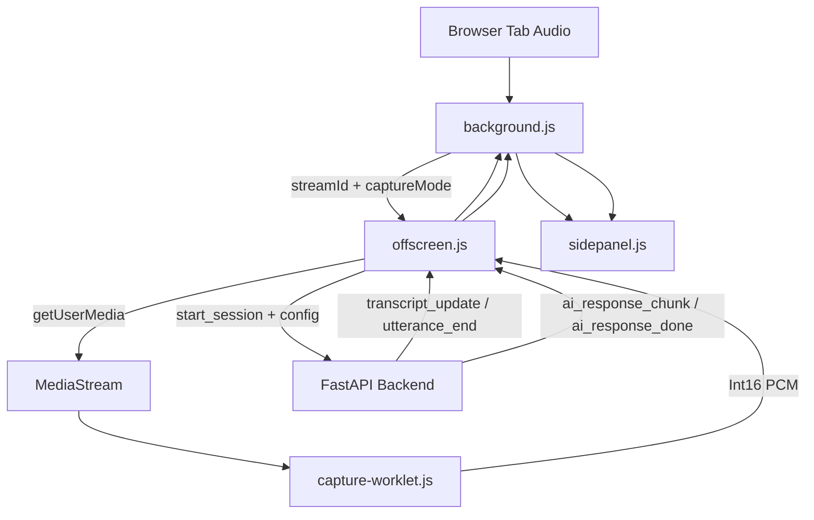

# Extension Architecture

## Purpose

The Chrome extension is the capture and presentation layer for the call-assist system. It no longer talks to Deepgram or Gemini directly. Its job is to capture tab and microphone audio, stream PCM to the backend, and render the transcript and AI response events that come back from the backend.

## Current Runtime Split

### Extension Responsibilities

- start and stop tab capture
- obtain `streamId` via `chrome.tabCapture`
- capture tab audio in an offscreen document
- convert Float32 audio to Int16 PCM in an audio worklet
- send the captured audio to the backend WebSocket
- render live transcript, context, customer info, and suggestion sections
- persist chat history and backend session id in extension storage

### Backend Responsibilities

- Deepgram streaming transcription
- utterance segmentation and filtering
- schema-driven customer-info extraction
- streaming AI suggestions
- session and ad-hoc summary APIs

## Main Components

### 1. Background Service Worker

- `extension/background.js`

Responsibilities:

- orchestrates capture state
- persists `currentSessionId` in `chrome.storage.local`
- stores transcript and AI messages
- starts and stops the offscreen audio bridge
- routes summary requests to:
  - `GET /api/sessions/{session_id}/summary`
  - fallback `POST /api/summary`

### 2. Offscreen Document

- `extension/offscreen.js`

Responsibilities:

- obtains the real audio stream via `getUserMedia`
- creates an `AudioContext` at 16 kHz
- registers the audio worklet
- opens the backend WebSocket session at `CONFIG.BACKEND_WS_URL`
- sends a `start_session` payload containing:
  - `deepgramParams`
  - `geminiModel`
  - `captureMode`
  - channel layout
- forwards backend transcript and AI events back into extension runtime messages

The current `deepgramParams` source includes `model=nova-3`, `language=multi`, `punctuate=true`, `utterance_end_ms`, `endpointing`, `encoding`, and `sample_rate`. The offscreen layer also sets `diarize=true` and `multichannel` based on capture mode.

### 3. Audio Worklet

- `extension/capture-worklet.js`

Responsibilities:

- converts captured Float32 audio samples into Int16 PCM
- posts PCM buffers back to the offscreen document for streaming

### 4. Side Panel UI

- `extension/sidepanel.js`
- `extension/sidepanel.html`

Responsibilities:

- renders live transcript cards
- renders backend-generated sections:
  - `Context`
  - `Customer Info`
  - `Suggestion`
- renders customer-info summary modal
- restores stored conversation messages when reopened

### 5. Content Script

- `extension/content.js`

Responsibilities:

- minimal reachability handshake for active tabs

## End-to-End Flow

## Messaging Contract

### Background -> Offscreen

- `START_CAPTURE`
- `STOP_CAPTURE`

### Offscreen -> Background

- `SESSION_READY`
- `TRANSCRIPT_RECEIVED`
- `UTTERANCE_COMMITTED`
- `AI_RESPONSE_CHUNK`
- `AI_RESPONSE_DONE`
- `API_ERROR`

### Background -> Side Panel

- `TRANSCRIPT_UPDATE`
- `AI_RESPONSE_CHUNK`
- `CAPTURE_STATUS_CHANGED`
- `UTTERANCE_END`
- `API_ERROR`

## Backend Event Contract Consumed By Offscreen

The backend sends JSON events such as:

- `session_started`
- `transcript_update`
- `utterance_end`
- `utterance_committed`
- `ai_response_chunk`
- `ai_response_done`
- `error`

These are translated into extension runtime messages by `extension/offscreen.js`.

## Configuration

- `extension/config.js`
- `extension/config.template.js`

Important keys:

- `BACKEND_WS_URL`
- `BACKEND_HTTP_URL`
- `DEEPGRAM_PARAMS`
- `GEMINI_MODEL`

The extension does not store Deepgram or Gemini API keys. The config file only controls capture parameters and backend endpoints.

## Storage

The extension stores:

- `messages`
- `isCapturing`
- `currentSessionId`
- `captureMode`

This lets the side panel restore the previous conversation state and reuse the current backend session summary endpoint when possible.

## Two-Way Conversation Features

- Captures both tab audio and microphone audio for mixed-stream processing
- Sends mixed audio to the backend for speaker-aware transcription
- Displays agent questions as AI suggestions
- Renders customer replies as transcript cards and persistent stored messages

## Current Constraints

- if the backend restarts, stored `currentSessionId` may no longer resolve to an active session
- summary falls back to ad-hoc extraction when the live session is unavailable
- audio capture still depends on browser tab audio availability and Chrome offscreen support
- microphone access requires user permission; the extension falls back to tab-only capture if denied
- punctuation is enabled for readability, but it does not replace turn finalization or utterance debounce

## Related Docs

- `docs/extension_README.md`
- `docs/backend_ARCHITECTURE.md`
