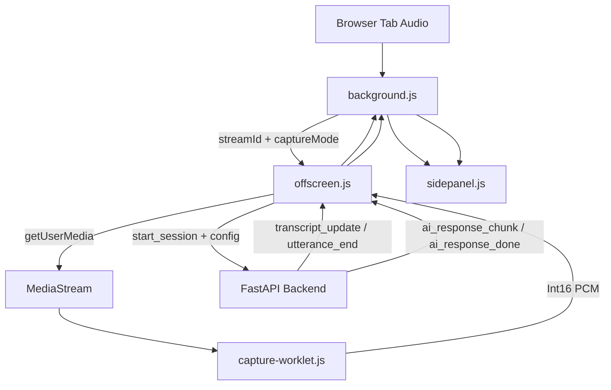

# Extension Architecture

## Purpose

The Chrome extension is the capture and presentation layer for the call-assist system. It does not talk to OpenAI, Gemini, or other model providers directly. Its job is to capture tab and microphone audio, stream PCM to the backend, and render the transcript, call responses, and chat responses that come back from the backend.

## Current Runtime Split

### Extension Responsibilities

- start and stop tab capture
- obtain `streamId` via `chrome.tabCapture`
- capture tab audio in an offscreen document
- convert Float32 audio to Int16 PCM in an audio worklet
- send the captured audio to the backend WebSocket
- render live call transcript, customer info, and suggestion sections
- provide a separate chat tab that talks to the backend `/api/chat` endpoint
- persist chat history and backend session id in extension storage

### Backend Responsibilities

- OpenAI Realtime transcription
- utterance segmentation and filtering
- schema-driven customer-info extraction
- streaming AI suggestions
- session and ad-hoc summary APIs

## Main Components

### 1. Background Service Worker

- `extension/background.js`

Responsibilities:

- orchestrates capture state
- persists `currentSessionId` in `chrome.storage.local`
- stores transcript and AI messages
- starts and stops the offscreen audio bridge
- routes summary requests to:
  - `GET /api/sessions/{session_id}/summary`
  - fallback `POST /api/summary`

### 2. Offscreen Document

- `extension/offscreen.js`

Responsibilities:

- obtains the real audio stream via `getUserMedia`
- creates an `AudioContext` at 24 kHz
- registers the audio worklet
- opens the backend WebSocket session at `CONFIG.BACKEND_WS_URL`
- sends a `start_session` payload containing:
  - `openaiTranscriptionParams`
  - `modelOverride`
  - `captureMode`
  - channel layout
- forwards backend transcript and AI events back into extension runtime messages

The current `openaiTranscriptionParams` source includes `model=gpt-4o-transcribe`, optional `language`, a transcription `prompt`, VAD tuning, and noise-reduction mode.

### 3. Audio Worklet

- `extension/capture-worklet.js`

Responsibilities:

- converts captured Float32 audio samples into Int16 PCM
- posts PCM buffers back to the offscreen document for streaming

### 4. Side Panel UI

- `extension/sidepanel.js`
- `extension/sidepanel.html`

Responsibilities:

- renders a two-tab panel with:
  - `Call`
  - `Chat`
- keeps the call view mounted so live capture updates continue even when chat is active
- renders live transcript cards
- renders backend-generated sections:
  - `Customer Info`
  - `Suggestion`
- renders a collapsible call-response history
- renders chat messages and chat input
- persists chat messages in `chrome.storage.local`
- restores stored conversation messages and chat state when reopened

### 5. Content Script

- `extension/content.js`

Responsibilities:

- minimal reachability handshake for active tabs

## End-to-End Flow

## Messaging Contract

### Background -> Offscreen

- `START_CAPTURE`
- `STOP_CAPTURE`

### Offscreen -> Background

- `SESSION_READY`
- `TRANSCRIPT_RECEIVED`
- `UTTERANCE_COMMITTED`
- `AI_RESPONSE_CHUNK`
- `AI_RESPONSE_DONE`
- `API_ERROR`

### Background -> Side Panel

- `TRANSCRIPT_UPDATE`
- `AI_RESPONSE_CHUNK`
- `CAPTURE_STATUS_CHANGED`
- `UTTERANCE_END`
- `API_ERROR`
- `CHAT_SEND`
- `CHAT_REPLY`

## Backend Event Contract Consumed By Offscreen

The backend sends JSON events such as:

- `session_started`
- `transcript_update`
- `utterance_end`
- `utterance_committed`
- `ai_response_chunk`
- `ai_response_done`
- `error`

These are translated into extension runtime messages by `extension/offscreen.js`.

## Configuration

- `extension/config.js`
- `extension/config.template.js`

Important keys:

- `BACKEND_WS_URL`
- `BACKEND_HTTP_URL`
- `OPENAI_TRANSCRIPTION_PARAMS`
- `LLM_MODEL`

The extension does not store OpenAI or LLM API keys. The config file only controls capture parameters, optional model override defaults, and backend endpoints.

## Storage

The extension stores:

- `messages`
- `chatMessages`
- `isCapturing`
- `currentSessionId`
- `captureMode`
- `activePanelTab`

This lets the side panel restore the previous conversation state, keep the call panel live across tab switches, and reuse the current backend session summary endpoint when possible.

## Two-Way Conversation Features

- Captures both tab audio and microphone audio for mixed-stream processing
- Sends mixed audio to the backend for speaker-aware transcription
- Displays agent questions as AI suggestions
- Renders customer replies as transcript cards and persistent stored messages
- Supports a chat-only mode for normal LLM Q&A without live transcription session state

## Current Constraints

- if the backend restarts, stored `currentSessionId` may no longer resolve to an active session
- summary falls back to ad-hoc extraction when the live session is unavailable
- audio capture still depends on browser tab audio availability and Chrome offscreen support
- microphone access requires user permission; the extension falls back to tab-only capture if denied
- punctuation is enabled for readability, but it does not replace turn finalization or utterance debounce

## Related Docs

- `docs/extension_README.md`
- `docs/backend_ARCHITECTURE.md`
