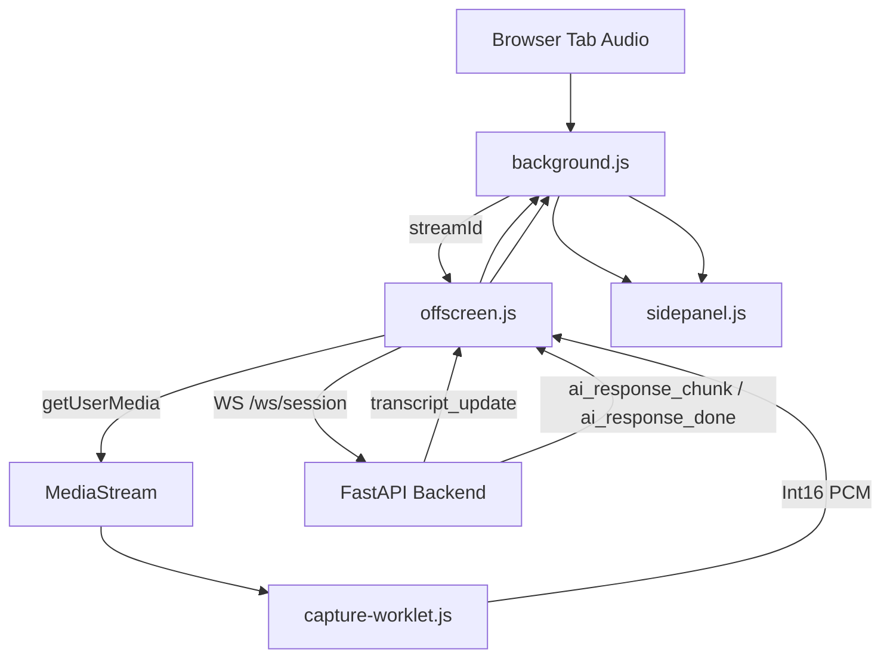

# Extension Architecture

## Purpose

The Chrome extension is the frontend capture and presentation layer for the call-assist system. It does not call Deepgram or Gemini directly anymore. Its main job is to capture tab audio, stream it to the backend, and render live transcript and suggestion updates returned by the backend.

## Current Runtime Split

### Extension Responsibilities

- start and stop tab capture
- obtain `streamId` via `chrome.tabCapture`
- capture tab audio in an offscreen document
- convert Float32 audio to Int16 PCM in an audio worklet
- stream PCM audio to the backend WebSocket
- render live transcript, context, customer info, and suggestion sections
- persist chat history and backend session id in extension storage

### Backend Responsibilities

- Deepgram streaming transcription
- utterance segmentation and filtering
- Gemini live suggestions
- schema-based customer info extraction
- session and ad-hoc summary APIs

## Main Components

### 1. Background Service Worker

- [extension/background.js](/home/amanpaswan/Documents/final/extension/background.js)

Responsibilities:

- orchestrates extension capture state
- persists `currentSessionId` in `chrome.storage.local`
- stores transcript and AI messages
- starts and stops the offscreen audio bridge
- routes summary requests to:
  - `GET /api/sessions/{session_id}/summary`
  - fallback `POST /api/summary`

### 2. Offscreen Document

- [extension/offscreen.js](/home/amanpaswan/Documents/final/extension/offscreen.js)

Responsibilities:

- obtains the real audio stream via `getUserMedia`
- creates `AudioContext` at `16kHz`
- registers the audio worklet
- opens backend WebSocket session at `CONFIG.BACKEND_WS_URL`
- sends raw PCM chunks to the backend
- forwards backend transcript and AI events back into extension runtime messages

### 3. Audio Worklet

- [extension/capture-worklet.js](/home/amanpaswan/Documents/final/extension/capture-worklet.js)

Responsibilities:

- converts captured Float32 audio samples into Int16 PCM
- posts PCM buffers back to the offscreen document for streaming

### 4. Side Panel UI

- [extension/sidepanel.js](/home/amanpaswan/Documents/final/extension/sidepanel.js)
- [extension/sidepanel.html](/home/amanpaswan/Documents/final/extension/sidepanel.html)

Responsibilities:

- renders live transcript cards
- renders backend-generated sections:
  - `Context`
  - `Customer Info`
  - `Suggestion`
- renders customer info summary modal
- restores stored conversation messages when reopened

### 5. Content Script

- [extension/content.js](/home/amanpaswan/Documents/final/extension/content.js)

Responsibilities:

- minimal reachability handshake for active tabs

## End-to-End Flow

## Messaging Contract

### Background -> Offscreen

- `START_CAPTURE`
- `STOP_CAPTURE`

### Offscreen -> Background

- `SESSION_READY`
- `TRANSCRIPT_RECEIVED`
- `UTTERANCE_COMMITTED`
- `AI_RESPONSE_CHUNK`
- `AI_RESPONSE_DONE`
- `API_ERROR`

### Background -> Side Panel

- `TRANSCRIPT_UPDATE`
- `AI_RESPONSE_CHUNK`
- `CAPTURE_STATUS_CHANGED`
- `UTTERANCE_END`
- `API_ERROR`

## Backend Event Contract Consumed By Offscreen

The backend sends JSON events such as:

- `session_started`
- `transcript_update`
- `utterance_end`
- `utterance_committed`
- `ai_response_chunk`
- `ai_response_done`
- `error`

These are translated into extension runtime messages by [extension/offscreen.js](/home/amanpaswan/Documents/final/extension/offscreen.js).

## Configuration

- [extension/config.js](/home/amanpaswan/Documents/final/extension/config.js)
- [extension/config.template.js](/home/amanpaswan/Documents/final/extension/config.template.js)

Important keys:

- `BACKEND_WS_URL`
- `BACKEND_HTTP_URL`
- `DEEPGRAM_PARAMS`
- `GEMINI_MODEL`

The extension no longer stores Deepgram or Gemini API keys.

## Storage

The extension stores:

- `messages`
- `isCapturing`
- `currentSessionId`

This allows the side panel to restore prior chat state and reuse the current backend session summary endpoint when possible.

## Current Constraints

- if the backend restarts, stored `currentSessionId` may no longer resolve to an active session
- summary falls back to ad-hoc extraction when the live session is unavailable
- audio capture still depends on browser tab audio availability and Chrome offscreen support

## Related Docs

- [docs/extension_README.md](/home/amanpaswan/Documents/final/docs/extension_README.md)
- [docs/backend_ARCHITECTURE.md](/home/amanpaswan/Documents/final/docs/backend_ARCHITECTURE.md)
