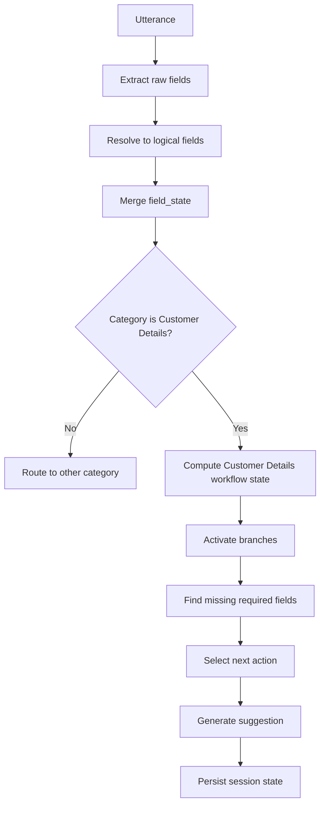
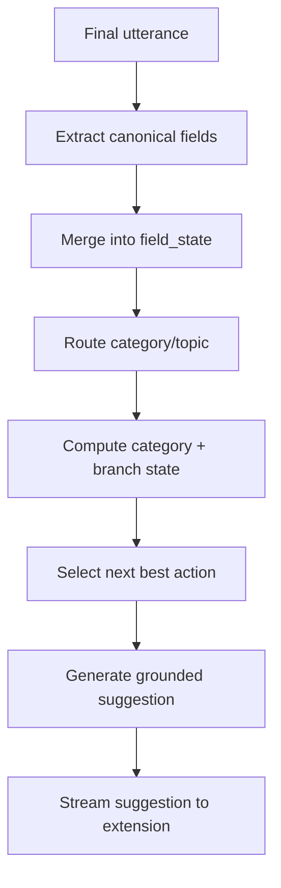

# Intelligent Lead Field System Design

## Goal

Create a conversation-aware lead copilot that can:

- organize messy GraphQL lead fields into business categories
- ask for the right missing fields inside the active category
- follow nested option branches, such as `loan_type = Balance transfer` requiring previous loan details
- switch category when the customer changes topic
- stop asking completed categories and move to the next best incomplete category
- keep suggestions grounded in the current conversation, loaded GraphQL data, and realtime extracted answers

The recommended architecture is a hybrid system:

- deterministic workflow engine for categories, required fields, option branches, completion, and priority
- field registry and resolver for many-to-one and one-to-many key mapping
- lightweight LLM classifier/extractor for ambiguous conversation understanding
- LLM response generator only after deterministic state decides what the next objective is

This avoids letting the model invent workflows while still allowing it to understand natural Hinglish conversation.

## Current Baseline

The repo already has most lower-level pieces:

- `backend/app/config/canonical_field_mapping.json`
  Maps a smaller high-priority subset of canonical fields to GraphQL paths, realtime extraction keys, labels, and some options.
- `backend/home_loan_schema.csv`
  Contains the larger extraction field list and human meanings.
- `backend/customer_info.json`
  Contains the structured JSON schema for the larger home-loan customer-info payload.
- `priority_fields.json`
  Contains high-priority GraphQL paths that should be asked before lower-value fields.
- dynamic loaded lead details
  The loaded GraphQL response can contain many paths that are not present in the compact canonical mapping.
- `backend/app/services/field_state_builder.py`
  Builds a canonical `field_state` from GraphQL facts plus realtime extracted fields.
- `backend/app/services/step_engine.py`
  Computes missing fields for the current flat step.
- `backend/app/services/suggestion_engine.py`
  Generates simple missing-field suggestions.
- `backend/app/graph/factory.py`
  Runs a LangGraph turn flow: `extract_schema -> generate_response`.
- `backend/app/llm/service.py`
  Builds extraction, response, chat, and lead-query prompts.

The current limitation is that `step_engine.py` has one flat `lead_offer` schema and `canonical_field_mapping.json` only covers a subset of all useful fields. The system needs a field registry that can resolve multiple keys and paths to one logical field before workflow/category logic runs.

## Core Idea

Add a field registry plus workflow layer above raw GraphQL and extraction keys:

```text
GraphQL lead detail
        |
        v
field inventory + alias resolver
        |
        v
resolved logical field_state
        |
        v
lead_workflow_schema.json
        |
        v
category_state + active_branch_state
        |
        v
conversation router
        |
        v
next_best_action
        |
        v
suggestion generator
```

The field registry is the source of truth for resolving names and paths.
The workflow schema is the source of truth for category grouping, priority, and conditional required fields.

## Field Registry And Resolver

Do not assume `canonical_field_mapping.json` contains every field. Treat it as one source for important high-priority API mappings.

Create a merged registry from:

```text
canonical_field_mapping.json
home_loan_schema.csv
customer_info.json
priority_fields.json
dynamic flattened GraphQL lead detail paths
manual aliases and derived-field rules
```

Each logical field should support multiple identifiers:

```json
{
  "id": "previous_emi_amount",
  "label": "Previous EMI amount",
  "category_hint": "loan_requirement",
  "types": ["number", "string"],
  "priority": "high",
  "keys": {
    "canonical": "previous_emi_amount",
    "realtime": ["existing_emi_amount", "previous_emi_amount", "monthly_emi"],
    "graphql": [
      "lead_details.prev_emi_amount",
      "loan_details.previous_emi_amount",
      "obligations.existing_emi_amount"
    ],
    "json_schema": ["obligations.existing_emi_amount"],
    "csv": ["existing_emi_amount"]
  },
  "aliases": [
    "previous emi",
    "old emi",
    "existing emi",
    "bt emi",
    "monthly emi"
  ],
  "options": [],
  "derived_from": []
}
```

This supports both cases:

- many raw keys map to one business field, such as `existing_emi_amount`, `monthly_emi`, and `lead_details.prev_emi_amount`
- one business concept may write to multiple downstream keys, such as mobile being available as `customer.mobile`, `mobile`, and `customer_mobile`

### Field Identity Rule

Use stable logical IDs inside workflow definitions. A logical ID does not have to equal a GraphQL path or old schema key.

Examples:

```text
logical id: customer_mobile
possible paths: customer.mobile, contact_details.mobile, contact_details.customer_mobile

logical id: pan_number
possible paths: customer.pancard_no, kyc_details.pancard_no, pancard_no

logical id: property_builder
possible paths: property_details.builder_id, property_details.builder_name_id, builder_name_id
```

The resolver should answer:

```python
resolve_field("customer.mobile") -> "customer_mobile"
resolve_field("customer_mobile") -> "customer_mobile"
resolve_field("contact_details.mobile") -> "customer_mobile"
resolve_field("mobile") -> "customer_mobile"
```

### Field Value Resolution

When the same logical field has multiple values, use deterministic precedence:

1. realtime customer correction from current conversation
2. explicit agent-confirmed value
3. loaded GraphQL value
4. legacy `customer_info` value
5. derived value

Keep all raw values for audit:

```json
{
  "field_id": "customer_mobile",
  "value": "9876543210",
  "source": "realtime",
  "status": "filled",
  "raw_values": [
    { "key": "customer.mobile", "value": "", "source": "graphql" },
    { "key": "customer_mobile", "value": "9876543210", "source": "realtime" }
  ],
  "resolved_from": "customer_mobile"
}
```

### Registry Build Pipeline

Add a service that builds one field index at startup and can extend it per loaded lead:

```python
class FieldRegistry:
    def resolve(self, key_or_path: str) -> str | None: ...
    def definition(self, field_id: str) -> FieldDefinition | None: ...
    def paths_for(self, field_id: str) -> list[str]: ...
    def extraction_keys_for(self, field_id: str) -> list[str]: ...
    def category_hint(self, field_id: str) -> str | None: ...
```

Registry build order:

1. load all fields from `customer_info.json`
2. enrich meanings from `home_loan_schema.csv`
3. overlay known exact mappings from `canonical_field_mapping.json`
4. mark priority from `priority_fields.json`
5. add manual aliases for business concepts and messy historical keys
6. when a lead is loaded, flatten GraphQL paths and add unseen paths as searchable registry entries

The registry should produce a conflict report:

```text
- raw key maps to multiple logical fields
- logical field has no known downstream GraphQL path
- priority path has no logical field
- workflow field id missing from registry
- same option value has different labels across sources
```

## Example: Application Data Categories

Treat the left-side Application Data options as top-level workflow categories:

```json
{
  "application_data": {
    "categories": [
      "loan_requirements",
      "customer_details",
      "income_details",
      "property_details",
      "offer_check",
      "details_sheet",
      "reference"
    ]
  }
}
```

Each category should have:

- `base_required_fields`: fields always required for that category
- `sections`: smaller UI/business groups inside the category
- `branches`: conditional fields activated by selected options or answers
- `completion_rule`: how to decide that the category is complete enough to move on

### Customer Details Category Example

From the application screen, Customer Details can be organized into these sections:

```text
Customer Details
  - Person identity
  - Contact
  - KYC
  - Current address
  - Family and profile
  - Employment snapshot
  - Co-applicant
```

Example workflow config:

```json
{
  "id": "customer_details",
  "label": "Customer Details",
  "application_option": "Customer Details",
  "required_for": ["offer_check"],
  "priority": 20,
  "topic_triggers": [
    "customer",
    "name",
    "mobile",
    "dob",
    "pan",
    "aadhaar",
    "address",
    "city",
    "pincode",
    "marital",
    "spouse",
    "qualification",
    "co applicant",
    "co-applicant"
  ],
  "base_required_fields": [
    "customer_first_name",
    "customer_last_name",
    "customer_mobile",
    "customer_dob",
    "customer_pan",
    "customer_city",
    "customer_state"
  ],
  "sections": [
    {
      "id": "person_identity",
      "label": "Person Identity",
      "fields": [
        "customer_first_name",
        "customer_last_name",
        "customer_gender",
        "customer_dob",
        "customer_mother_name",
        "customer_marital_status",
        "customer_qualification",
        "customer_preferred_language"
      ]
    },
    {
      "id": "contact",
      "label": "Contact",
      "fields": [
        "customer_mobile",
        "customer_email",
        "customer_official_email"
      ]
    },
    {
      "id": "kyc",
      "label": "KYC",
      "fields": [
        "customer_pan",
        "customer_aadhaar"
      ]
    },
    {
      "id": "current_address",
      "label": "Current Address",
      "fields": [
        "customer_pincode",
        "customer_state",
        "customer_city",
        "customer_address_line1",
        "customer_address_line2"
      ]
    },
    {
      "id": "employment_snapshot",
      "label": "Employment Snapshot",
      "fields": [
        "customer_occupation",
        "customer_designation",
        "customer_office_address",
        "customer_company_name",
        "customer_total_work_experience",
        "customer_current_job_years"
      ]
    },
    {
      "id": "co_applicant",
      "label": "Co-applicant",
      "fields": [
        "has_co_applicant"
      ]
    }
  ],
  "branches": [
    {
      "id": "married_customer",
      "when": {
        "field": "customer_marital_status",
        "operator": "equals_any",
        "value": ["married", "Married", "1"]
      },
      "required_fields": [
        "customer_spouse_name"
      ],
      "suggestion_goal": "If marital status is married, ask spouse name before moving out of Customer Details."
    },
    {
      "id": "customer_address_incomplete",
      "when": {
        "field": "customer_pincode",
        "operator": "exists"
      },
      "required_fields": [
        "customer_state",
        "customer_city",
        "customer_address_line1"
      ],
      "suggestion_goal": "Once pincode is known, confirm city, state, and address line."
    },
    {
      "id": "salaried_or_employed_customer",
      "when": {
        "field": "customer_occupation",
        "operator": "matches_any",
        "value": ["salaried", "job", "employee", "service"]
      },
      "required_fields": [
        "customer_company_name",
        "customer_designation",
        "customer_total_work_experience",
        "customer_current_job_years",
        "customer_official_email"
      ],
      "suggestion_goal": "If customer is salaried, collect company, designation, experience, and official email."
    },
    {
      "id": "co_applicant_present",
      "when": {
        "field": "has_co_applicant",
        "operator": "truthy"
      },
      "required_fields": [
        "coapplicant_first_name",
        "coapplicant_last_name",
        "coapplicant_mobile",
        "coapplicant_dob",
        "coapplicant_pan"
      ],
      "suggestion_goal": "If agent adds co-applicant, switch collection to co-applicant fields."
    },
    {
      "id": "coapplicant_address_not_same",
      "when": {
        "all": [
          {
            "field": "has_co_applicant",
            "operator": "truthy"
          },
          {
            "field": "coapplicant_same_as_customer_address",
            "operator": "falsy"
          }
        ]
      },
      "required_fields": [
        "coapplicant_pincode",
        "coapplicant_state",
        "coapplicant_city",
        "coapplicant_address_line1"
      ],
      "suggestion_goal": "If co-applicant address is not same as customer address, ask co-applicant address fields."
    }
  ],
  "completion_rule": {
    "mode": "required_fields_and_active_branches",
    "minimum_required_status": "filled",
    "ignore_optional_fields": true
  }
}
```

### Customer Details Field Registry Example

The workflow should use logical field IDs, while the resolver maps those IDs to UI labels, extraction keys, and GraphQL paths.

```json
{
  "customer_first_name": {
    "label": "First Name",
    "ui_labels": ["First Name"],
    "graphql_paths": ["customer.first_name", "customer_details.first_name"],
    "realtime_keys": ["first_name", "customer_first_name"],
    "aliases": ["first name", "customer name", "naam"]
  },
  "customer_last_name": {
    "label": "Last Name",
    "ui_labels": ["Last Name"],
    "graphql_paths": ["customer.last_name", "customer_details.last_name"],
    "realtime_keys": ["last_name", "customer_last_name"],
    "aliases": ["last name", "surname"]
  },
  "customer_mobile": {
    "label": "Mobile Number",
    "ui_labels": ["Mobile Number"],
    "graphql_paths": ["customer.mobile", "contact_details.mobile", "contact_details.customer_mobile"],
    "realtime_keys": ["mobile", "customer_mobile", "phone_number"],
    "aliases": ["mobile", "phone", "contact number"]
  },
  "customer_dob": {
    "label": "DOB",
    "ui_labels": ["DOB"],
    "graphql_paths": ["customer.dob", "customer_details.dob"],
    "realtime_keys": ["dob", "customer_dob"],
    "aliases": ["dob", "date of birth", "birth date"]
  },
  "customer_pan": {
    "label": "PAN No.",
    "ui_labels": ["PAN No.", "PAN card"],
    "graphql_paths": ["customer.pancard_no", "kyc_details.pancard_no"],
    "realtime_keys": ["pancard_no", "pan_number", "customer_pan"],
    "aliases": ["pan", "pan card", "pancard"]
  },
  "customer_aadhaar": {
    "label": "Aadhar Number",
    "ui_labels": ["Aadhar Number", "Aadhaar Number"],
    "graphql_paths": ["customer.aadhar_no", "kyc_details.aadhar_no"],
    "realtime_keys": ["aadhar_no", "aadhaar_no", "customer_aadhaar"],
    "aliases": ["aadhaar", "aadhar", "aadhaar number"]
  },
  "customer_marital_status": {
    "label": "Marital Status",
    "ui_labels": ["Marital Status"],
    "graphql_paths": ["customer.marital_status", "customer_details.marital_status"],
    "realtime_keys": ["marital_status", "customer_marital_status"],
    "aliases": ["marital status", "married", "single"]
  },
  "customer_spouse_name": {
    "label": "Spouse Name",
    "ui_labels": ["Spouse Name"],
    "graphql_paths": ["customer.spouse_name", "customer_details.spouse_name"],
    "realtime_keys": ["spouse_name", "customer_spouse_name"],
    "aliases": ["spouse name", "wife name", "husband name"]
  },
  "customer_pincode": {
    "label": "Pin Code",
    "ui_labels": ["Pin Code"],
    "graphql_paths": ["customer.pincode", "current_address.cra_pincode", "residence_details.cra_pincode"],
    "realtime_keys": ["pincode", "cra_pincode", "customer_pincode"],
    "aliases": ["pin code", "pincode", "postal code"]
  },
  "customer_state": {
    "label": "State",
    "ui_labels": ["State"],
    "graphql_paths": ["customer.state", "current_address.cra_state", "residence_details.cra_state"],
    "realtime_keys": ["state", "cra_state", "customer_state"],
    "aliases": ["state", "rajya"]
  },
  "customer_city": {
    "label": "City",
    "ui_labels": ["City"],
    "graphql_paths": ["customer.city", "current_address.cra_city", "residence_details.cra_city"],
    "realtime_keys": ["city", "cra_city", "customer_city"],
    "aliases": ["city", "shehar"]
  },
  "customer_address_line1": {
    "label": "Address Line1",
    "ui_labels": ["Address Line1"],
    "graphql_paths": ["customer.address_line1", "current_address.cra_address1", "residence_details.cra_address1"],
    "realtime_keys": ["address_line1", "cra_address1", "customer_address_line1"],
    "aliases": ["address", "address line 1", "current address"]
  }
}
```

### How Suggestions Should Behave In Customer Details

Example 1: customer gives mobile and city.

```text
Customer: Mobile 9876543210 hai, Mumbai mein rehta hun.
```

State update:

```json
{
  "customer_mobile": "9876543210",
  "customer_city": "Mumbai"
}
```

Next action:

```json
{
  "type": "ask_field",
  "category": "customer_details",
  "section": "person_identity",
  "field": "customer_dob",
  "reason": "Customer Details is active and DOB is required for Offer Check."
}
```

Suggestion:

```text
Sir DOB confirm kar dijiye, offer check ke liye required hai.
```

Example 2: customer says married.

```text
Customer: Haan married hun.
```

Active branch:

```json
{
  "branch": "married_customer",
  "required_fields": ["customer_spouse_name"]
}
```

Suggestion:

```text
Sir spouse name kya update karna hai?
```

Example 3: agent clicks Add Co-Applicant.

```json
{
  "has_co_applicant": true
}
```

The active collection context should shift from `customer_*` fields to `coapplicant_*` fields until required co-applicant fields are filled.

## Customer Details Implementation Flow

This section describes the concrete flow to implement the Customer Details category first, before expanding the same architecture to Loan Requirements, Income Details, Property Details, Offer Check, Details Sheet, and Reference.

### 1. Define Logical Fields

Start with one logical field list for Customer Details. These are the IDs the workflow engine uses.

```json
{
  "customer_details_fields": [
    "customer_first_name",
    "customer_last_name",
    "customer_gender",
    "customer_dob",
    "customer_mobile",
    "customer_email",
    "customer_pan",
    "customer_aadhaar",
    "customer_marital_status",
    "customer_spouse_name",
    "customer_mother_name",
    "customer_qualification",
    "customer_preferred_language",
    "customer_pincode",
    "customer_state",
    "customer_city",
    "customer_address_line1",
    "customer_address_line2",
    "customer_office_address",
    "customer_dependents",
    "customer_designation",
    "customer_occupation",
    "customer_official_email",
    "customer_company_name",
    "customer_total_work_experience",
    "customer_current_job_years",
    "has_co_applicant",
    "coapplicant_first_name",
    "coapplicant_last_name",
    "coapplicant_mobile",
    "coapplicant_dob",
    "coapplicant_pan",
    "coapplicant_same_as_customer_address",
    "coapplicant_pincode",
    "coapplicant_state",
    "coapplicant_city",
    "coapplicant_address_line1"
  ]
}
```

The UI label, GraphQL path, old extraction key, and spoken aliases should all map to these IDs.

### 2. Add Customer Field Aliases To The Registry

Add customer-specific field aliases to the single registry config:

`backend/app/config/field_aliases.json`

Example:

```json
{
  "customer_mobile": {
    "label": "Mobile Number",
    "ui_labels": ["Mobile Number"],
    "graphql_paths": ["customer.mobile", "contact_details.mobile", "contact_details.customer_mobile"],
    "realtime_keys": ["mobile", "customer_mobile", "phone_number"],
    "aliases": ["mobile", "phone", "contact number"]
  },
  "customer_pan": {
    "label": "PAN No.",
    "ui_labels": ["PAN No.", "PAN card"],
    "graphql_paths": ["customer.pancard_no", "kyc_details.pancard_no"],
    "realtime_keys": ["pancard_no", "pan_number", "customer_pan"],
    "aliases": ["pan", "pan card", "pancard"]
  },
  "customer_dob": {
    "label": "DOB",
    "ui_labels": ["DOB"],
    "graphql_paths": ["customer.dob", "customer_details.dob"],
    "realtime_keys": ["dob", "customer_dob"],
    "aliases": ["dob", "date of birth", "birth date"]
  },
  "customer_city": {
    "label": "City",
    "ui_labels": ["City"],
    "graphql_paths": ["customer.city", "current_address.cra_city", "residence_details.cra_city"],
    "realtime_keys": ["city", "cra_city", "customer_city"],
    "aliases": ["city", "shehar"]
  }
}
```

This file is the manual correction layer for fields where multiple systems use different names.

### 3. Add Customer Stage To Workflow Config

Add the customer-details category to the single workflow config:

`backend/app/config/lead_workflow_schema.json`

```json
{
  "id": "customer_details",
  "label": "Customer Details",
  "required_for": ["offer_check"],
  "base_required_fields": [
    "customer_first_name",
    "customer_last_name",
    "customer_mobile",
    "customer_dob",
    "customer_pan",
    "customer_city",
    "customer_state"
  ],
  "field_priority": [
    "customer_mobile",
    "customer_dob",
    "customer_pan",
    "customer_city",
    "customer_state",
    "customer_address_line1",
    "customer_marital_status",
    "customer_mother_name",
    "customer_email"
  ],
  "sections": [
    {
      "id": "person_identity",
      "fields": [
        "customer_first_name",
        "customer_last_name",
        "customer_gender",
        "customer_dob",
        "customer_mother_name",
        "customer_marital_status",
        "customer_qualification"
      ]
    },
    {
      "id": "contact_kyc",
      "fields": [
        "customer_mobile",
        "customer_email",
        "customer_pan",
        "customer_aadhaar"
      ]
    },
    {
      "id": "address",
      "fields": [
        "customer_pincode",
        "customer_state",
        "customer_city",
        "customer_address_line1",
        "customer_address_line2"
      ]
    },
    {
      "id": "employment_snapshot",
      "fields": [
        "customer_occupation",
        "customer_designation",
        "customer_office_address",
        "customer_official_email",
        "customer_company_name",
        "customer_total_work_experience",
        "customer_current_job_years"
      ]
    }
  ],
  "branches": [
    {
      "id": "married_customer",
      "when": {
        "field": "customer_marital_status",
        "operator": "equals_any",
        "value": ["married", "1"]
      },
      "required_fields": ["customer_spouse_name"]
    },
    {
      "id": "co_applicant_present",
      "when": {
        "field": "has_co_applicant",
        "operator": "truthy"
      },
      "required_fields": [
        "coapplicant_first_name",
        "coapplicant_last_name",
        "coapplicant_mobile",
        "coapplicant_dob",
        "coapplicant_pan"
      ]
    },
    {
      "id": "coapplicant_address_required",
      "when": {
        "all": [
          { "field": "has_co_applicant", "operator": "truthy" },
          { "field": "coapplicant_same_as_customer_address", "operator": "falsy" }
        ]
      },
      "required_fields": [
        "coapplicant_pincode",
        "coapplicant_state",
        "coapplicant_city",
        "coapplicant_address_line1"
      ]
    }
  ]
}
```

### 4. Runtime Turn Flow

For every finalized customer or agent utterance:

```text
1. Receive utterance
2. Extract raw fields from utterance
3. Resolve raw keys to logical Customer Details fields
4. Merge resolved values into field_state
5. Detect active category
6. If active category is customer_details, compute Customer Details workflow state
7. Activate conditional branches
8. Select next missing field by priority
9. Generate agent suggestion from selected action
10. Save active category, active branch, and last action in session state
```

Mermaid flow:



### 5. Customer Details State Shape

Store category state in the session:

```json
{
  "active_category": "customer_details",
  "customer_details_state": {
    "status": "in_progress",
    "active_sections": ["person_identity", "contact_kyc", "address"],
    "active_branches": ["married_customer"],
    "filled_fields": [
      "customer_first_name",
      "customer_last_name",
      "customer_mobile",
      "customer_city"
    ],
    "missing_fields": [
      "customer_dob",
      "customer_pan",
      "customer_state",
      "customer_spouse_name"
    ],
    "next_field": "customer_dob"
  },
  "last_action": {
    "type": "ask_field",
    "category": "customer_details",
    "field": "customer_dob",
    "question": "Sir DOB confirm kar dijiye."
  }
}
```

### 6. Next Field Selection

Use this deterministic order:

```text
1. If customer just answered a field, do not ask it again.
2. If an active branch has missing required fields, ask those first.
3. Else ask missing fields from `field_priority`.
4. Else ask remaining base required fields.
5. Else mark Customer Details complete and move to the next category needed for Offer Check.
```

Example:

```json
{
  "filled": ["customer_mobile", "customer_city"],
  "missing": ["customer_dob", "customer_pan", "customer_state"],
  "field_priority": ["customer_mobile", "customer_dob", "customer_pan", "customer_city", "customer_state"]
}
```

Next field:

```json
{
  "field": "customer_dob",
  "reason": "Highest-priority missing Customer Details field required for Offer Check."
}
```

### 7. Suggestion Contract

The suggestion generator should receive a deterministic action:

```json
{
  "type": "ask_field",
  "category": "customer_details",
  "section": "person_identity",
  "field": "customer_dob",
  "label": "DOB",
  "reason": "Required for Offer Check",
  "known_context": {
    "customer_first_name": "Rahul",
    "customer_last_name": "Test",
    "customer_mobile": "******9976",
    "customer_city": "Mumbai"
  },
  "last_suggestion": ""
}
```

Expected model output:

```text
[SUMMARY]Customer details mein mobile aur city available hain.
[SUGGESTION]Sir DOB confirm kar dijiye, offer check ke liye required hai.
```

The model should only phrase the question. It should not decide the next field.

### 8. Integration Points

Implement Customer Details with these changes:

```text
backend/app/config/field_aliases.json
backend/app/config/lead_workflow_schema.json
backend/app/services/field_registry.py
backend/app/services/field_resolver.py
backend/app/services/next_action.py
backend/app/graph/state.py
backend/app/graph/nodes.py
backend/app/graph/factory.py
backend/app/services/session_turn_runner.py
backend/app/llm/service.py
```

Suggested service responsibilities:

```python
# field_registry.py
load registry sources and resolve raw keys/paths to logical IDs

# field_resolver.py
convert GraphQL facts and extracted fields into logical field_state entries

# next_action.py
choose next ask_field / switch_category / category_complete action
```

### 9. Tests For First Implementation

Add focused tests before expanding to other categories:

```text
1. mobile key variants resolve to customer_mobile
2. customer.mobile GraphQL value fills customer_mobile
3. customer_mobile realtime value overrides missing GraphQL value
4. married status activates customer_spouse_name
5. unmarried status does not ask spouse name
6. has_co_applicant activates coapplicant fields
7. same_as_customer_address skips coapplicant address fields
8. not-same coapplicant address activates coapplicant address fields
9. completed Customer Details moves next action to offer_check or next incomplete category
10. last asked field is not repeated after customer answers it
```

### 10. Minimal First Milestone

The first useful implementation does not need every field. Start with this thin vertical slice:

```text
customer_mobile
customer_dob
customer_pan
customer_city
customer_state
customer_marital_status
customer_spouse_name
has_co_applicant
coapplicant_mobile
coapplicant_pan
```

Once this slice works end to end, add the remaining Customer Details fields as registry/config entries without changing the engine.

## New Workflow Schema

Create a new config file:

`backend/app/config/lead_workflow_schema.json`

Example:

```json
{
  "version": 1,
  "categories": [
    {
      "id": "loan_requirement",
      "label": "Loan requirement",
      "priority": 10,
      "topic_triggers": ["loan", "amount", "top up", "balance transfer", "home loan", "lap"],
      "base_required_fields": ["loan_type", "loan_amount"],
      "branches": [
        {
          "when": { "field": "loan_type", "operator": "equals", "value": "1" },
          "label": "Home loan",
          "required_fields": ["is_property_decided"]
        },
        {
          "when": { "field": "loan_type", "operator": "equals", "value": "4" },
          "label": "Balance transfer",
          "required_fields": [
            "previous_loan_amount",
            "previous_emi_amount",
            "previous_loan_start_date",
            "previous_tenure",
            "previous_current_roi",
            "remaining_loan_amount"
          ]
        },
        {
          "when": { "field": "loan_type", "operator": "equals", "value": "3" },
          "label": "Top-up",
          "required_fields": [
            "previous_loan_amount",
            "remaining_loan_amount",
            "previous_current_roi"
          ]
        }
      ]
    },
    {
      "id": "customer_profile",
      "label": "Customer profile",
      "priority": 20,
      "topic_triggers": ["name", "mobile", "pan", "dob", "profession", "salary", "business"],
      "base_required_fields": [
        "profession",
        "customer.mobile",
        "customer.pancard_no",
        "customer.dob"
      ],
      "branches": [
        {
          "when": { "field": "profession", "operator": "equals", "value": "1" },
          "label": "Salaried",
          "required_fields": ["monthly_salary"]
        },
        {
          "when": { "field": "profession", "operator": "equals", "value": "2" },
          "label": "Self-employed",
          "required_fields": ["income_calculation_mode"]
        }
      ]
    },
    {
      "id": "property_details",
      "label": "Property details",
      "priority": 30,
      "topic_triggers": ["property", "flat", "ghar", "city", "builder", "project", "registration"],
      "base_required_fields": ["is_property_identified"],
      "branches": [
        {
          "when": { "field": "is_property_identified", "operator": "truthy" },
          "label": "Property identified",
          "required_fields": [
            "property_city",
            "property_state",
            "expected_market_value",
            "registration_value",
            "property_type",
            "property_sub_type",
            "agreement_type",
            "builder_id",
            "project_id",
            "check_oc_cc",
            "ready_for_registration"
          ]
        }
      ]
    },
    {
      "id": "fulfillment",
      "label": "Fulfillment",
      "priority": 40,
      "topic_triggers": ["fulfillment", "process", "documents", "next step"],
      "base_required_fields": ["fulfillment_type"]
    }
  ]
}
```

Important rule: field IDs in the workflow schema must be logical IDs from the field registry. They should not depend on whether the source key came from GraphQL, realtime extraction, CSV, or JSON schema.

## Runtime State

Extend per-session state with workflow information:

```json
{
  "active_category": "loan_requirement",
  "active_branch": "balance_transfer",
  "last_category": "customer_profile",
  "category_scores": {
    "loan_requirement": 0.82,
    "customer_profile": 0.12,
    "property_details": 0.06
  },
  "category_state": {
    "loan_requirement": {
      "status": "in_progress",
      "missing_fields": ["previous_current_roi", "remaining_loan_amount"],
      "completed_fields": ["loan_type", "loan_amount", "previous_loan_amount"],
      "active_branches": ["Balance transfer"]
    }
  },
  "last_next_action": {
    "category": "loan_requirement",
    "field": "previous_current_roi",
    "question": "Sir current loan ka ROI kitna chal raha hai?"
  }
}
```

This should live beside existing `field_state`, not replace it.

## Turn Pipeline

Replace the flat turn logic with this flow:



Recommended LangGraph nodes:

1. `extract_schema`
   Existing node. Extract canonical field values from the current customer utterance.

2. `route_category`
   Determine which category the current conversation belongs to.

3. `compute_workflow_state`
   Evaluate base required fields and branch required fields using current `field_state`.

4. `select_next_action`
   Pick the next missing field or category transition.

5. `generate_response`
   Generate final agent-facing suggestion from the selected action.

## Category Router

Use a two-stage router.

### Stage 1: Deterministic Scoring

Score categories from:

- topic trigger keywords
- newly extracted fields
- fields asked by the agent in the last utterance
- currently active category
- incomplete category priority

Example scoring:

```text
+0.50 if utterance matches category topic triggers
+0.40 if newly extracted field belongs to category
+0.30 if agent last question targeted this category
+0.15 if category was already active
-0.30 if category is complete
```

### Stage 2: LLM Classifier

Use only when deterministic confidence is low or two categories are close.

Return strict JSON:

```json
{
  "category": "property_details",
  "confidence": 0.78,
  "reason": "Customer mentioned property city and builder"
}
```

The final router should prefer deterministic results when confidence is high.

## Branch Evaluation

Each branch has a condition:

```json
{ "field": "loan_type", "operator": "equals", "value": "4" }
```

Supported operators:

- `equals`
- `in`
- `truthy`
- `falsy`
- `exists`
- `not_exists`

Branch required fields are active only when their condition is satisfied.

Example:

- `loan_type = 4` means Balance transfer branch is active.
- The system asks previous loan amount, EMI, tenure, ROI, remaining amount.
- If later the customer corrects to `loan_type = 1`, the Balance transfer branch is deactivated and Home loan fields become active.

## Next Best Action Policy

The action selector should return one of these actions:

```json
{
  "type": "ask_field",
  "category": "loan_requirement",
  "field": "previous_current_roi",
  "reason": "Required for Balance transfer and still missing"
}
```

```json
{
  "type": "switch_category",
  "from_category": "loan_requirement",
  "to_category": "property_details",
  "reason": "Customer moved to property topic"
}
```

```json
{
  "type": "category_complete",
  "category": "customer_profile",
  "next_category": "property_details",
  "reason": "Customer profile is complete; property has missing required fields"
}
```

Selection rules:

1. If customer changed topic with high confidence, switch to that category.
2. If active category has active missing fields, ask the highest-priority missing field.
3. If active category is complete, move to the next incomplete category by priority.
4. If all categories are complete, ask for document/process confirmation.
5. Do not repeat the previous question unless the customer did not answer it.

## Suggestion Generation

The LLM should not decide the workflow. It should phrase the selected deterministic action naturally.

Prompt input should include:

```json
{
  "active_category": "loan_requirement",
  "active_branch": "Balance transfer",
  "selected_action": {
    "type": "ask_field",
    "field": "previous_current_roi",
    "label": "Previous current ROI"
  },
  "known_fields": {
    "loan_type": "4",
    "previous_loan_amount": "3500000"
  },
  "field_resolution": {
    "previous_loan_amount": {
      "graphql_paths": ["lead_details.prev_loan_amount"],
      "realtime_keys": ["previous_loan_amount"]
    }
  },
  "last_suggestion": "Sir previous loan amount kitna hai?"
}
```

Expected output:

```text
[SUMMARY]Customer balance transfer discuss kar rahe hain aur previous loan amount confirm ho gaya hai.
[INFO]{"loan_type":"4","previous_loan_amount":"3500000"}
[SUGGESTION]Sir current loan ka ROI kitna chal raha hai?
```

## Files To Add

### `backend/app/config/field_aliases.json`

Manual aliases and equivalence groups for messy historical mappings.

Example:

```json
{
  "customer_mobile": {
    "keys": ["mobile", "customer_mobile", "customer.mobile", "contact_details.mobile"],
    "aliases": ["mobile", "phone", "customer phone", "contact number"]
  },
  "pan_number": {
    "keys": ["pancard_no", "customer.pancard_no", "kyc_details.pancard_no"],
    "aliases": ["pan", "pan card", "pancard"]
  }
}
```

### `backend/app/config/lead_workflow_schema.json`

Declarative category and branch definition.

### `backend/app/services/field_registry.py`

Loads and merges all field sources into one logical field index.

Core functions:

```python
def load_field_registry() -> FieldRegistry: ...
def resolve_field_key(key_or_path: str) -> str | None: ...
def get_field_definition(field_id: str) -> FieldDefinition | None: ...
```

### `backend/app/services/field_resolver.py`

Resolves incoming values from GraphQL, realtime extraction, and legacy schema keys into logical field IDs.

Core functions:

```python
def resolve_graphql_facts(facts: dict) -> dict[str, FieldValue]: ...
def resolve_extracted_fields(fields: dict) -> dict[str, FieldValue]: ...
def merge_field_values(existing: dict, incoming: dict) -> dict: ...
```

### `backend/app/services/workflow_schema.py`

Loads and validates workflow schema.

Core functions:

```python
def load_workflow_schema() -> WorkflowSchema: ...
def category_for_field(field_id: str) -> str | None: ...
def fields_for_category(category_id: str) -> list[str]: ...
```

### `backend/app/services/category_router.py`

Routes the current turn to the best category.

Core function:

```python
def route_category(
    utterance: str,
    extracted_fields: dict,
    field_state: dict,
    previous_category: str | None,
    agent_last_utterance: str = "",
) -> CategoryRoute: ...
```

### `backend/app/services/workflow_state.py`

Computes missing fields by category and active branch.

Core function:

```python
def compute_workflow_state(
    field_state: dict,
    active_category: str | None,
) -> dict: ...
```

### `backend/app/services/next_action.py`

Chooses the next best action.

Core function:

```python
def select_next_action(
    workflow_state: dict,
    route: CategoryRoute,
    last_action: dict | None,
) -> dict: ...
```

### `backend/app/services/mapping_audit.py`

Produces a report for missing, duplicate, and conflicting mappings.

Core functions:

```python
def audit_field_registry(registry: FieldRegistry, workflow_schema: dict) -> list[MappingIssue]: ...
```

## Files To Modify

### `backend/app/graph/state.py`

Add:

```python
active_category: str | None
workflow_state: dict
next_action: dict
category_route: dict
```

### `backend/app/graph/factory.py`

Change graph from:

```text
extract_schema -> generate_response
```

to:

```text
extract_schema -> route_category -> compute_workflow_state -> select_next_action -> generate_response
```

### `backend/app/graph/nodes.py`

Add nodes for category routing, workflow computation, and next action selection.

### `backend/app/services/session_turn_runner.py`

Pass session workflow state into `turn_state`, then save updated category/action state after each turn.

### `backend/app/services/field_state_builder.py`

Modify this to use the new resolver instead of checking only one `graphql_path` and one `realtime_key` per canonical key.

The current shape:

```python
graphql_path: str
realtime_key: str
```

should become:

```python
graphql_paths: list[str]
realtime_keys: list[str]
legacy_keys: list[str]
raw_values: list[dict]
```

### `backend/app/llm/service.py`

Change response prompt so it receives `next_action` and treats it as the instruction source for `[SUGGESTION]`.

## Example Behavior

### Balance Transfer Flow

Conversation:

```text
Customer: Mujhe balance transfer karwana hai.
```

System:

- extracts `loan_type = 4`
- routes to `loan_requirement`
- activates Balance transfer branch
- asks previous loan details

Suggestion:

```text
Sir current loan ka outstanding amount kitna bacha hai?
```

### Customer Changes Topic

Conversation:

```text
Customer: Property Noida mein hai, builder ATS hai.
```

System:

- extracts `property_city = noida`, maybe `builder_id/name = ATS`
- routes to `property_details`
- switches suggestion context from loan requirement to property details

Suggestion:

```text
Sir property ka expected market value kitna hai?
```

### Category Complete

If all `customer_profile` required fields are filled:

- mark `customer_profile = complete`
- do not keep asking PAN/DOB/mobile
- move to the next incomplete category, such as property or fulfillment

## Implementation Phases

### Phase 1: Deterministic Workflow Layer

- add field registry and mapping audit
- add workflow schema using logical field IDs
- compute category missing fields and branch missing fields
- replace flat `lead_offer` missing calculation in suggestion flow
- add tests for branch activation and category completion

### Phase 2: Resolver-Aware Field State

- merge values from all known key systems
- support multiple GraphQL paths and realtime keys per logical field
- preserve raw values and selected resolved value
- make priority field checks use resolved logical fields, not exact string paths only

### Phase 3: Category Router

- deterministic router based on field ownership and trigger keywords
- store `active_category` in session state
- switch suggestions when topic changes
- add tests for topic switching

### Phase 4: LLM Router Fallback

- add strict JSON category classifier only for low-confidence routing
- log router confidence and selected category
- add replay tests from realistic Hinglish conversations

### Phase 5: Better Suggestions

- make `generate_response` consume `next_action`
- prevent repeated questions
- add field-level question templates for important fields

## Testing Strategy

Add tests for:

- `loan_type = Balance transfer` activates previous-loan fields
- `loan_type = Home loan` does not ask Balance transfer fields
- `profession = Salaried` asks salary
- `profession = Self-employed` asks income calculation mode
- customer topic switch changes active category
- completed category is skipped
- GraphQL-filled fields are not asked again
- realtime extracted values override missing GraphQL values
- `customer.mobile`, `customer_mobile`, and `mobile` resolve to the same logical field
- priority GraphQL paths resolve even when field values come from legacy/customer-info keys
- unseen flattened GraphQL paths are available for chat/search but do not become required workflow fields until mapped
- mapping audit reports workflow fields missing from registry
- last suggestion is not repeated

## Recommended Design Choice

Use a hybrid architecture, not a pure multi-agent system.

Reason:

- the workflow is business-rule heavy and should be deterministic
- GraphQL field mapping needs exact logical IDs with a resolver for multiple raw keys and paths
- conditional branches should be auditable and testable
- LLMs are useful for intent/topic ambiguity and natural phrasing, not for deciding required fields from scratch

A multi-agent design would add latency and debugging complexity without solving the core problem better than a deterministic workflow engine plus targeted LLM calls.
