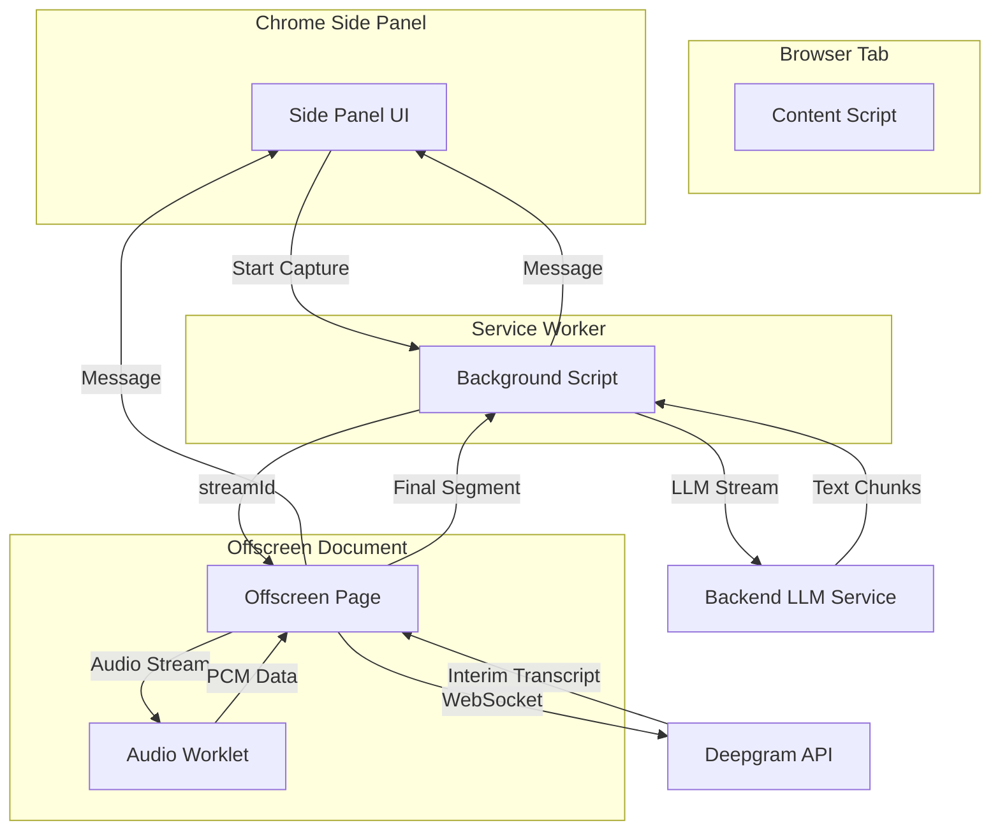

# System Architecture

The Chrome extension is designed to provide low-latency, real-time audio transcription and AI-driven analysis. It leverages a modern Manifest V3 architecture with a multi-process approach.

## 1. High-Level Overview

The system operates as a hub-and-spoke model with the **Background Service Worker** at the center.

### Components:
- **Background Script (`background.js`)**: Orchestrates the entire system. It manages the extension's state, coordinates communication between components, and handles the streaming interaction with the backend AI service.
- **Offscreen Document (`offscreen.js`)**: A necessary workaround for Manifest V3. Since service workers cannot capture audio streams or maintain long-running WebSockets efficiently, the Offscreen Document provides a stable environment for audio capture and Deepgram streaming.
- **Audio Worklet (`capture-worklet.js`)**: A low-latency audio processor running in its own thread. It converts high-fidelity Float32 audio samples into the Int16 PCM format required by Deepgram.
- **Side Panel (`sidepanel.js`)**: The primary user interface. It renders live transcription updates and displays AI-generated responses chunk-by-chunk.
- **Content Script (`content.js`)**: Used for a basic handshake to ensure the target tab is active and reachable for audio capture.

## 2. Audio Capture & Transcription Pipeline (Is it Streaming?)

**Yes, the entire system is designed for end-to-end streaming.**

### Step 1: Capture
- When the user starts capture, the Background Script uses the `chrome.tabCapture` API to generate a `streamId` for the active tab.
- This `streamId` is passed to the **Offscreen Document**.
- The Offscreen Document uses `navigator.mediaDevices.getUserMedia` with the `streamId` to obtain the actual audio stream.

### Step 2: Processing (The Audio Worklet)
- The raw stream is fed into an `AudioWorkletNode`.
- Inside `capture-worklet.js`, the audio is processed in real-time. It down-samples or converts the format (Float32 to Int16) to optimize for network transmission.

### Step 3: Transcription (Deepgram Streaming)
- The Offscreen Document opens a persistent **WebSocket** connection to Deepgram's streaming API (`wss://api.deepgram.com/v1/listen`).
- PCM audio data is sent over the WebSocket as it arrives from the worklet.
- Deepgram returns `interim_results: true`. This allows the Side Panel to display "partial" transcripts as words are spoken, updating them as the AI gains more confidence.

## 3. AI Analysis Pipeline (Backend LLM Streaming)

### Triggering Analysis
- Deepgram emits a `UTTERANCE_END` event when it detects a natural break in speech (a "segment").
- The **Offscreen Document** sends this finalized segment to the **Background Script**.

### Streaming AI Responses
- The Background Script calls the backend LLM service and streams the response chunks back to the UI.
- Instead of waiting for a full JSON response, the script parses the response as a stream of **Server-Sent Events (SSE)**.
- Each text chunk is immediately broadcast to the **Side Panel** via `chrome.runtime.sendMessage`.
- The UI appends these chunks to the display, creating a "typing" effect in real-time.

## 4. Communication Diagram

## 5. Security and API Keys

API keys are stored in `config.js` (excluded from Git). The extension follows security best practices by limiting content script permissions and using a central background script for sensitive network requests.
